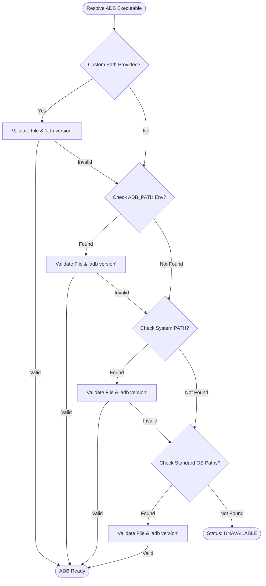

# KELVRA Device Lab — ADB Runtime Management (`docs/ADB_RUNTIME_MANAGEMENT.md`)

## 1. Architectural Philosophy

KELVRA Device Lab treats the Android Debug Bridge (`adb`) as an untrusted, externally managed host utility. Proprietary Google SDK binaries are **never bundled or redistributed** with the application. Instead, the runtime management subsystem discovers, validates, and sandboxes communication with the host-installed ADB executable.

---

## 2. Executable Resolution Order

When initializing `AndroidDeviceProvider` or responding to runtime configuration changes (`POST /api/providers/android/configure`), the resolver probes the following locations in strict priority order:

1. **Explicit Custom Argument:** Passed directly via constructor or API request payload.
2. **Environment Variable:** `ADB_PATH` environment variable if defined and non-empty.
3. **System PATH Resolution:** `shutil.which("adb")` inspecting system `PATH`.
4. **Standard Windows SDK Locations:**
   - `%LOCALAPPDATA%\Android\Sdk\platform-tools\adb.exe`
   - `%USERPROFILE%\AppData\Local\Android\Sdk\platform-tools\adb.exe`
5. **Standard Unix/macOS Locations:**
   - `~/Android/Sdk/platform-tools/adb`
   - `~/Library/Android/sdk/platform-tools/adb`
   - `/opt/android-sdk/platform-tools/adb`



---

## 3. Subprocess Execution Guardrails

All interactions with the ADB executable pass through `_run_adb_cmd()` in `src/android_provider.py`. The execution pipeline enforces five mandatory isolation constraints:

### 3.1 Prohibition of Shell Invocation (`shell=False`)
Process execution is never performed through shell interpreters (`cmd.exe`, `powershell.exe`, `/bin/sh`). Arguments are passed exclusively as discrete string vectors:
```python
# SECURE: Direct vector invocation
proc = subprocess.Popen(
    [self._adb_path, "-s", serial, "shell", "getprop"],
    stdout=subprocess.PIPE,
    stderr=subprocess.PIPE,
    shell=False
)
```

### 3.2 Strict Execution Timeout Bounding
Every command is subject to a hard timeout (default: 5.0 seconds). If the command exceeds this budget:
1. `subprocess.TimeoutExpired` is trapped.
2. `proc.kill()` is sent immediately to terminate the hung process.
3. `proc.wait(timeout=1.0)` is invoked to reap the process exit code, preventing zombie process leaks.
4. A structured failure result is returned without throwing unhandled exceptions to the caller.

### 3.3 Output Buffer Truncation (64 KB Cap)
Malicious or malfunctioning devices can produce infinite streams on stdout (e.g. runaway logs or massive system dumps). The stream reader consumes at most 65,536 bytes (`max_bytes=65536`):
```python
stdout_bytes = proc.stdout.read(max_bytes + 1)
if len(stdout_bytes) > max_bytes:
    proc.kill()
    proc.wait()
    stdout_bytes = stdout_bytes[:max_bytes]
```

### 3.4 Process Leak Prevention & Re-entrancy Locking
Fleet discovery (`discover_devices`) is protected by a re-entrancy lock (`threading.Lock()`). Concurrent requests from frontend pollers or background workers queue cleanly rather than spawning overlapping bursts of `adb devices -l` subprocesses.

---

## 4. Graceful Degradation When ADB is Missing

If no valid ADB binary exists on the host machine:
- The provider does not crash the server or raise startup exceptions.
- `get_health()` reports:
  - `status`: `ProviderStatus.UNAVAILABLE`
  - `details`: `"ADB binary not found on host machine. Configure path in Settings."`
- Discovery returns an empty list `[]` without error.
- The UI displays an informative empty state informing the developer how to install platform-tools or supply a custom path in the Settings page.
- Once configured via `POST /api/providers/android/configure`, the provider tests the binary with `adb version` and switches immediately to `ProviderStatus.READY`.
