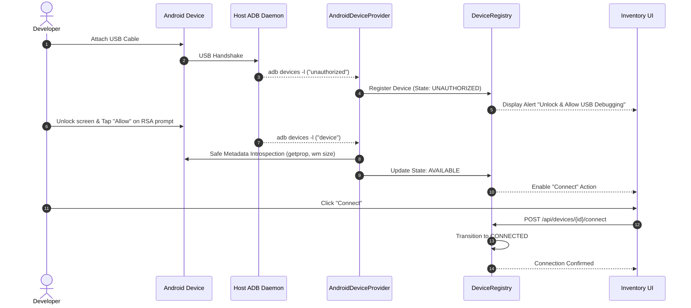

# KELVRA Device Lab — Android Connection Workflow (`docs/ANDROID_CONNECTION_WORKFLOW.md`)

## 1. Connection Lifecycle Overview

Android physical devices follow a deterministic state progression from USB cable attachment to active teleoperation session lease.



---

## 2. Authorization & Physical RSA Confirmation

### 2.1 The Android Trust Model
Android requires cryptographic key exchange (ADB RSA keys) before allowing debug commands. When a workstation connects to a device for the first time or after key revocation, ADB lists the device as `unauthorized`.

### 2.2 Strict Zero-Bypass Policy
KELVRA Device Lab strictly adheres to the Android operating system security contract:
- **NO BYPASS:** KELVRA never attempts to bypass, spoof, or click through the RSA authorization modal using simulated input or unauthorized exploits.
- **EXPLICIT GUIDANCE:** The system registers the device in `DeviceLifecycleState.UNAUTHORIZED` and injects an actionable human-readable recovery hint:
  ```json
  {
    "code": "ADB_UNAUTHORIZED",
    "message": "Device is unauthorized. Unlock device screen and tap 'Allow USB debugging' on the RSA prompt."
  }
  ```
- **ACCESS RESTRICTION:** All REST endpoints that read device properties (`/api/devices/{id}/properties`) or display geometry (`/api/devices/{id}/display`) return `HTTP 403 Forbidden` while in the unauthorized state.

---

## 3. Connection & Session Acquisition

1. **Prerequisite Verification:** Connection (`POST /api/devices/{id}/connect`) requires the device to be in the `AVAILABLE` lifecycle state. If the device is `UNAUTHORIZED`, `OFFLINE`, or `MAINTENANCE`, the request is rejected with `HTTP 409 Conflict`.
2. **Transition Execution:** The registry atomically transitions the device from `AVAILABLE` to `CONNECTED`.
3. **Session Lease Preparation:** In subsequent streaming phases, connection attaches an exclusive single-writer operator lease with heartbeat renewal.

---

## 4. Disconnection & Cleanup Workflow

1. **User-Initiated Disconnection:** Triggered via `POST /api/devices/{id}/disconnect`.
2. **Resource Reclaiming:**
   - Active operator leases are released.
   - Per-serial property cache entries are invalidated.
   - The device lifecycle state returns to `AVAILABLE`.
3. **Hardware Detach (Cable Unplug):**
   - When `adb devices -l` no longer reports the serial, the registry detects the hardware disappearance.
   - If a session was held, it is aborted with `ERROR_ABORTED`.
   - The device transitions to `OFFLINE` and is eventually reaped or retained as historical record according to retention policies.
