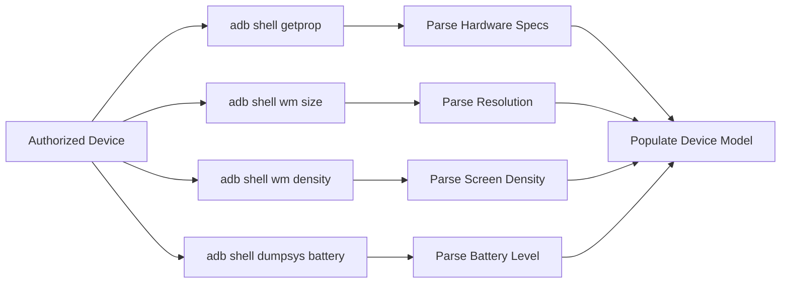

# KELVRA Device Lab — Android Device Metadata (`docs/ANDROID_DEVICE_METADATA.md`)

## 1. Introspection Strategy & Privacy Guarantees

KELVRA Device Lab retrieves only the hardware and operating system metadata required for fleet cataloging, session routing, and viewport configuration.

### Privacy Contract: Zero Personal Data Collection
The introspection engine operates under strict privacy boundaries:
- **PROHIBITED:** Reading user accounts, contacts, SMS messages, call logs, camera feeds, clipboard buffers, or personal documents.
- **PROHIBITED:** Querying third-party installed application databases or user credentials.
- **PERMITTED:** Reading standard hardware identifiers, display metrics, OS version levels, system ABIs, and power subsystem status.

---

## 2. Metadata Extraction Mechanisms

Device metadata is queried only when a device is in the verified `device` (authorized) state.



### 2.1 System Properties (`getprop`)
Executing `adb -s <serial> shell getprop` provides bracketed key-value pairs (`[ro.product.model]: [Pixel 7]`). The parser sanitizes and populates:

| System Property | Target Device Field | Fallback Default |
|:---|:---|:---|
| `ro.product.manufacturer` | `device.manufacturer` | `Unknown` |
| `ro.product.model` | `device.model` | `Android Device` |
| `ro.build.version.release` | `device.os_version` | `14.0` |
| `ro.build.version.sdk` | `device.sdk_level` | `34` |
| `ro.product.cpu.abi` | `device.abi` | `arm64-v8a` |

### 2.2 Display Geometry (`wm size`)
Executing `adb -s <serial> shell wm size` returns either physical size or override size:
- Expected format: `Physical size: 1080x2400` or `Override size: 1080x2340`
- Parsed into `device.display_resolution = "1080x2400"`

### 2.3 Display Density (`wm density`)
Executing `adb -s <serial> shell wm density` returns dots per inch:
- Expected format: `Physical density: 420` or `Override density: 440`
- Parsed into `device.display_density = 420`

### 2.4 Battery Telemetry (`dumpsys battery`)
Queried on demand via `check_device_health()`:
- Scans for `level: [0-9]+`
- Safely populates `battery_level` (0-100) or `None` if unreadable.

---

## 3. Caching & Invalidation Architecture

Subprocess calls across USB or Wi-Fi transports introduce latency (~50-200ms per command). To prevent sluggishness during high-frequency fleet polling:

1. **TTL-Backed Cache:** Device properties are cached in memory for **60.0 seconds** keyed by device serial:
   ```python
   self._property_cache[serial] = (time.time(), properties)
   ```
2. **Deterministic Cache Hits:** Successive discovery iterations reuse cached properties while verifying device presence via `adb devices -l`.
3. **Explicit Invalidation:**
   - Invalidation is automatically triggered on device disconnect.
   - Developers or automated test suites can force cache eviction via `POST /api/devices/{id}/refresh` or calling `provider.invalidate_cache(serial)`.
4. **Hardware Disappearance:** When a device detaches from USB, its cache entry is automatically pruned to prevent stale data retention.
