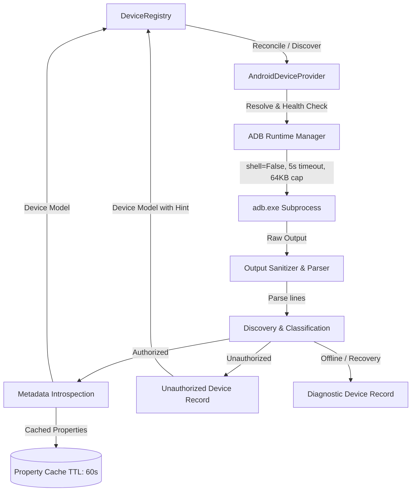

# KELVRA Device Lab — Android Provider Implementation (`docs/ANDROID_PROVIDER_IMPLEMENTATION.md`)

## 1. Overview & Architecture

The `AndroidDeviceProvider` (`src/android_provider.py`) is the hardware discovery and introspection engine for Android devices in KELVRA Device Lab. Implementing the `BaseDeviceProvider` interface (`src/provider_base.py`), it interfaces with host Android Debug Bridge (`adb`) runtimes while maintaining strict security boundaries, re-entrancy guarantees, bounded process lifecycles, and read-only introspection contracts.



---

## 2. Key Responsibilities & Capabilities

1. **Host Executable Resolution:** Deterministic multi-stage discovery of `adb.exe` without bundling proprietary binaries.
2. **Provider Lifecycle & Health:** Live diagnostics tracking provider readiness (`READY`, `UNAVAILABLE`, `ERROR`), binary path, daemon version, and error details.
3. **Physical & Virtual Differentiation:** Accurate classification of physical USB hardware, Wi-Fi connected devices, and Android Virtual Devices (`emulator-*`).
4. **Hardware State Normalization:** Mapping ADB raw states (`device`, `unauthorized`, `offline`, `bootloader`, `recovery`, `sideload`) into standard `DeviceLifecycleState` enumerations.
5. **Read-Only Introspection:** Safe retrieval of manufacturer, model, OS version, SDK level, ABI, display dimensions, and pixel density.
6. **Property Caching & Invalidation:** Thread-safe per-serial property caching with TTL to eliminate redundant subprocess execution.
7. **Thread Safety & Re-entrancy Protection:** Discovery concurrency guarded with `threading.Lock()` to prevent race conditions during parallel fleet scans.

---

## 3. Class Structure & Interface Implementation

`AndroidDeviceProvider` inherits from `BaseDeviceProvider` and implements the complete provider lifecycle contract:

```python
class AndroidDeviceProvider(BaseDeviceProvider):
    def __init__(self, adb_path: Optional[str] = None):
        super().__init__(name="android")
        self._custom_adb_path = adb_path
        self._adb_path = self._resolve_adb_path(adb_path)
        self._discovery_lock = threading.Lock()
        self._property_cache: Dict[str, Tuple[float, Dict[str, str]]] = {}
        self._cache_ttl = 60.0  # seconds

    def discover_devices(self) -> List[Device]:
        """Discovers attached Android devices via 'adb devices -l'."""

    def connect_device(self, device_id: str) -> bool:
        """Validates device readiness for session lease acquisition."""

    def disconnect_device(self, device_id: str) -> bool:
        """Cleans up session leases and flushes volatile caches."""

    def get_health(self) -> ProviderHealth:
        """Returns provider status, resolved ADB path, and daemon version."""
```

### Extended Safe Read-Only Methods
- `get_device_properties(serial: str) -> Dict[str, str]`: Safely executes `adb -s <serial> shell getprop` with output size limiting.
- `get_display_info(serial: str) -> Tuple[Optional[str], Optional[int]]`: Safely extracts physical display resolution (`wm size`) and density (`wm density`).
- `check_device_health(serial: str) -> Dict[str, Any]`: Verifies online availability, state, response latency, and battery percentage.
- `invalidate_cache(serial: Optional[str] = None)`: Flushes cached properties for a specific device or the entire provider.

---

## 4. Hardware Classification Logic

The provider distinguishes between transport types and device classes using deterministic serial parsing:

| Target Serial Pattern | Platform Identifier | Device Type | Connection Transport |
|:---|:---|:---|:---|
| `emulator-[0-9]+` | `DevicePlatform.ANDROID_VIRTUAL` | `DeviceType.EMULATOR` | `ConnectionTransport.EMULATOR_PIPE` |
| `[0-9.]+:[0-9]+` | `DevicePlatform.ANDROID_PHYSICAL` | `DeviceType.PHYSICAL` | `ConnectionTransport.WIFI` |
| All other alphanumeric serials | `DevicePlatform.ANDROID_PHYSICAL` | `DeviceType.PHYSICAL` | `ConnectionTransport.USB` |

---

## 5. Security & Isolation Guarantees

- **No Shell Injection:** All process invocations execute with `shell=False` passing argument vectors as lists (`[adb_path, "-s", serial, ...]`).
- **Resource Exhaustion Defense:** Subprocess calls enforce a strict `timeout=5.0s` and cap stdout reading to 64 KB (`max_bytes=65536`).
- **Process Cleanup:** Upon timeout, `proc.kill()` and `proc.wait()` ensure no orphaned or zombie ADB client processes linger on host operating systems.
- **Unauthorized Hardware Protection:** Devices in the `unauthorized` state are blocked from metadata extraction and session leasing; REST endpoints return `HTTP 403 Forbidden` until physical RSA trust is confirmed.
- **Zero Personal Data Extraction:** The provider strictly avoids inspecting user accounts, contacts, SMS, call logs, camera hardware, or personal files.

---

## 6. Sibling Repository Boundaries

The Android Physical Device Provider executes exclusively within `Kelvra/KELVRA Device Lab/`. It does not import, modify, or interact with `Kelvra/kelvra-voice/` or `Kelvra/kelvra-bench/`.
