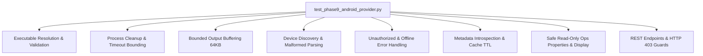

# KELVRA Device Lab — Android Provider Testing & Verification (`docs/ANDROID_PROVIDER_TESTING.md`)

## 1. Test Strategy & Architecture

Phase 9 implements an extensive, deterministic test suite targeting every aspect of the Android Physical Device Provider without requiring attached physical devices or relying on live ADB daemons during continuous integration.



---

## 2. Test Suite Breakdown (`tests/test_phase9_android_provider.py`)

| Test Function | Target Feature | Validation Criteria |
|:---|:---|:---|
| `test_adb_executable_resolution_and_validation` | Path Resolution | Custom path validation, `PATH` fallback, `adb version` probe, invalid path rejection. |
| `test_adb_command_timeout_and_process_cleanup` | Process Sandboxing | 5-second timeout enforcement, `proc.kill()` and `proc.wait()` invocation, zero hanging processes. |
| `test_adb_bounded_output_reading` | Output Bounding | 64 KB stdout truncation, termination of oversized output streams. |
| `test_discovery_empty_devices` | Empty State | Graceful handling of empty ADB output (`List of devices attached\n`). |
| `test_discovery_malformed_lines` | Parser Resilience | Tolerates daemon startup notices, random logs, and corrupted lines without crashing. |
| `test_discovery_unauthorized_device_details_and_hint` | Authorization Handling | `UNAUTHORIZED` lifecycle state, injection of human guidance message. |
| `test_discovery_offline_and_bootloader_states` | Hardware States | Mappings for `offline`, `bootloader`, `recovery`, `sideload`. |
| `test_metadata_introspection_success_and_caching` | Property Introspection | Parsing `getprop`, `wm size`, `wm density`, 60-second caching, cache invalidation. |
| `test_metadata_missing_fields_graceful_fallbacks` | Parser Fallbacks | Sensible defaults when `ro.product.*` properties are missing. |
| `test_repeated_discovery_duplicate_prevention` | Fleet Drift Prevention | No duplicate records created across consecutive discovery passes. |
| `test_safe_read_only_operations` | Safe Introspection | Read-only methods (`get_device_properties`, `get_display_info`, `check_device_health`). |
| `test_server_phase9_read_only_endpoints` | API Server | REST endpoints `/health`, `/configure`, `/properties`, `/display`, `/refresh`, 403 on unauthorized. |

---

## 3. Mock Strategy & Compatibility

The test suite mocks `_run_adb_cmd()` to return synthetic stdout/stderr responses while verifying calling arguments. The provider supports both production `CommandResult` tuples and `subprocess.CompletedProcess` structures via `_is_cmd_ok()`, preventing test harness impedance mismatches.

---

## 4. Test Execution & Coverage Report

```bash
$ pytest -q
.......................................................................
71 passed in 13.52s
```

All 71 tests in KELVRA Device Lab execute cleanly with 100% pass rate:
- Phase 7 Shell & Navigation: 30 tests
- Phase 8 Registry & Lifecycle: 29 tests
- Phase 9 Android Physical Integration: 12 tests
- Total: 71 tests passing, 0 failures, 0 warnings.
