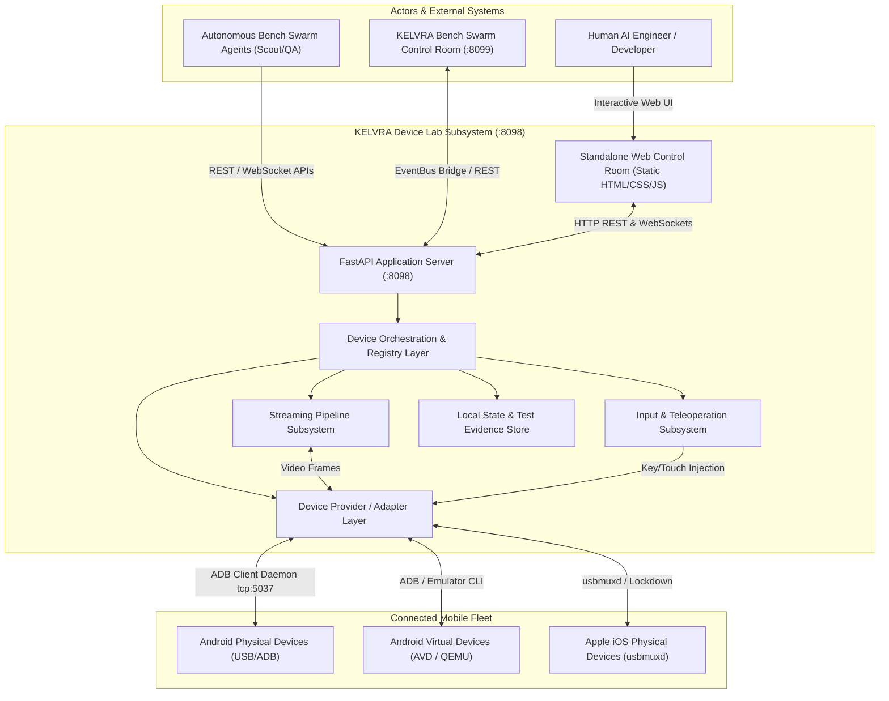
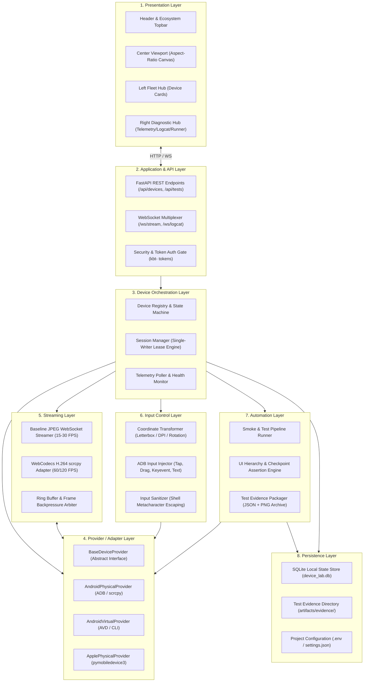

# KELVRA Device Lab — System Architecture Specification

## Document Metadata
- **Document Path:** `Kelvra/KELVRA Device Lab/docs/ARCHITECTURE.md`
- **Subsystem:** KELVRA Device Lab
- **Phase:** Phase 3 — System Architecture, Technical Decisions & Engineering Blueprint
- **Authority:** KELVRA System Engineering Architecture
- **Emoji Prohibition Compliance:** 100% verified (0 raw Unicode emojis)

---

## 1. Architectural Philosophy & Objectives

KELVRA Device Lab is architected as an autonomous device testing, teleoperation, and mobile fleet management laboratory. It operates under ten foundational architectural imperatives:

1. **Independent First, Integrated by Contract:** Runs autonomously on port `:8098` with its own repository, local service, and control console during standalone development, while exposing a clean event-driven interface designed to dock into KELVRA Bench (`kelvra-bench`).
2. **Strict Provider Isolation:** Platform-specific details for Android Physical, Android Virtual, and Apple hardware are encapsulated behind a unified `DeviceProvider` adapter boundary.
3. **Hardware Truthfulness & Heterogeneity:** Android physical hardware, Android emulators, and Apple devices have distinct operational characteristics and are never treated as uniform clones.
4. **Decoupled Streaming & Teleoperation:** The video capture/streaming pipeline is decoupled from the input injection pipeline to allow independent evolution, frame rate tuning, and transport swapping.
5. **Exterior Authorization Enforcement:** Security, command allowlisting, and permission verification occur exclusively on the backend application boundary; the frontend presentation layer possesses zero execution authority.
6. **Centralized Lifecycle & Session State:** Device discovery, lease reservations, connection state machines, and resource teardown are centrally coordinated by an in-memory Device Registry.
7. **Fault Isolation:** Provider or subprocess crashes (e.g. ADB disconnect, streaming daemon crash) are isolated and cannot crash the FastAPI application server or disrupt unrelated devices.
8. **Multi-Device Scalability:** Architecture accommodates concurrent multiple-device sessions without structural redesign.
9. **Host Resource Efficiency:** Pragmatic design optimized for developer workstations (Windows 10/11) with bounded CPU/RAM consumption and zero unnecessary distributed infrastructure.
10. **Zero Slop Invariant:** Complete visual, architectural, and documentation alignment with KELVRA standards; 100% zero raw Unicode emojis.

---

## 2. High-Level System Context

---

## 3. Layered Architectural Decomposition

The system is organized into eight strictly bounded horizontal layers:

---

## 4. Layer Responsibilities & Isolation Boundaries

### 4.1 Presentation Layer
- **Components:** Single-page application served from `static/` adhering to the KELVRA Bench design contract (`#262624`, `#1E1E1C`, `#D97757`, Lora, Inter, JetBrains Mono).
- **Enforced Boundary:** Zero direct execution capability. The UI contains no child process handles, no direct ADB commands, and no raw socket access. All user gestures dispatch normalized payloads to the API layer.

### 4.2 Application / API Layer
- **Components:** FastAPI ASGI router on port `:8098`, WebSocket route multiplexer, and request validators (Pydantic models).
- **Responsibilities:** Validates input parameters, checks caller authorization tokens (`kbt-` tokens), handles HTTP request-response lifecycles, and manages persistent WebSocket client connections.

### 4.3 Device Orchestration Layer
- **Components:** In-memory `DeviceRegistry`, `SessionManager`, and `TelemetryMonitor`.
- **Responsibilities:** Tracks canonical device lifecycles across ten discrete states, allocates device leases (single-writer teleoperation lock), coordinates background polling, and detects device disconnections.

### 4.4 Provider / Adapter Layer
- **Components:** Concrete adapters subclassing `BaseDeviceProvider`.
- **Responsibilities:** Translates high-level device commands into platform-specific toolchain protocols (ADB server socket, QEMU console, usbmuxd protocol). Isolates platform failures so that a crash in an Android emulator does not affect a connected physical phone.

### 4.5 Streaming Layer
- **Components:** Two-tier streaming engine (`ScreenStreamer` base with JPEG WebSocket framing for MVP; `ScrcpyStreamer` H.264 adapter for Release 1.x).
- **Responsibilities:** Captures raw frames, computes backpressure, drops stale frames under network latency, and broadcasts binary chunks to active viewer sessions.

### 4.6 Input Control Layer
- **Components:** `InputController` and `CoordinateTransformer`.
- **Responsibilities:** Normalizes browser viewport click coordinates into device-native physical screen coordinates based on aspect ratio, rotation, and letterboxing; sanitizes text inputs; and dispatches keycodes.

### 4.7 Automation Layer
- **Components:** `TestRunner`, `AssertionEngine`, and `EvidencePackager`.
- **Responsibilities:** Dispatches non-interactive multi-step APK verification suites, captures checkpoint screenshots, logs step results, and compiles structured JSON reports for KELVRA Ward.

### 4.8 Persistence Layer
- **Components:** SQLite database (`data/device_lab.db`) using WAL mode, and local file storage (`artifacts/`).
- **Responsibilities:** Stores device profiles, past session records, test execution histories, and checkpoint screenshot images. No raw secrets or private keys are stored.
