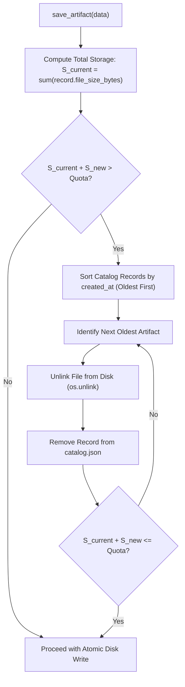

# KELVRA Device Lab — Artifact Retention & Storage Quota Policy

## Document Metadata
- **Document Path:** `Kelvra/KELVRA Device Lab/docs/ARTIFACT_RETENTION.md`
- **Subsystem:** Automation & Observability Subsystem
- **Phase:** Phase 13 — Device Automation, Screenshots, Recordings, Logs & Diagnostics
- **Authority:** Disk Quota Accounting, Automated Pruning & Eviction Policies
- **Emoji Prohibition Compliance:** 100% verified (0 raw Unicode emojis)

---

## 1. Executive Summary

Continuous automated test execution and video recording can generate gigabytes of media assets, risking host disk exhaustion. The Artifact Retention Subsystem enforces a deterministic 500 MB storage quota with an automated Least-Recently-Used (LRU) pruning pipeline that evicts the oldest artifacts when capacity thresholds are reached.

---

## 2. Storage Quota Boundaries

- **Default Workstation Quota:** `524,288,000` bytes (500 MB).
- **Accounting Method:** Calculated on every write operation by summing physical file sizes registered in the `catalog.json` database.
- **Configurability:** Workstations with dedicated storage arrays can configure higher retention ceilings via the `quota_bytes` parameter during service initialization.

---

## 3. Automated LRU Pruning Lifecycle

When `ArtifactManager.save_artifact()` is invoked with a binary payload of size $S_{\text{new}}$:



---

## 4. Eviction Transparency & Auditability

Eviction operations are systematically logged to the application audit log with artifact metadata:
```
2026-10-04 05:32:00.123 [INFO] kelvra.device_lab.artifacts: Pruned oldest artifact art-48b01c99f123 (screenshots/screen_old.jpeg, 45120 bytes) to maintain 500MB quota.
```
This guarantees that operators can audit which assets were automatically removed to accommodate incoming test runs.

---

## 5. Storage Inspection Endpoint

Workstations and CI runners can monitor quota consumption via `GET /api/artifacts/storage/summary`:

```json
{
  "total_artifacts": 42,
  "used_bytes": 184512000,
  "quota_bytes": 524288000,
  "utilization_percent": 35.2,
  "artifacts_by_type": {
    "screenshot": 28,
    "recording": 3,
    "log_export": 6,
    "automation_report": 5
  }
}
```
