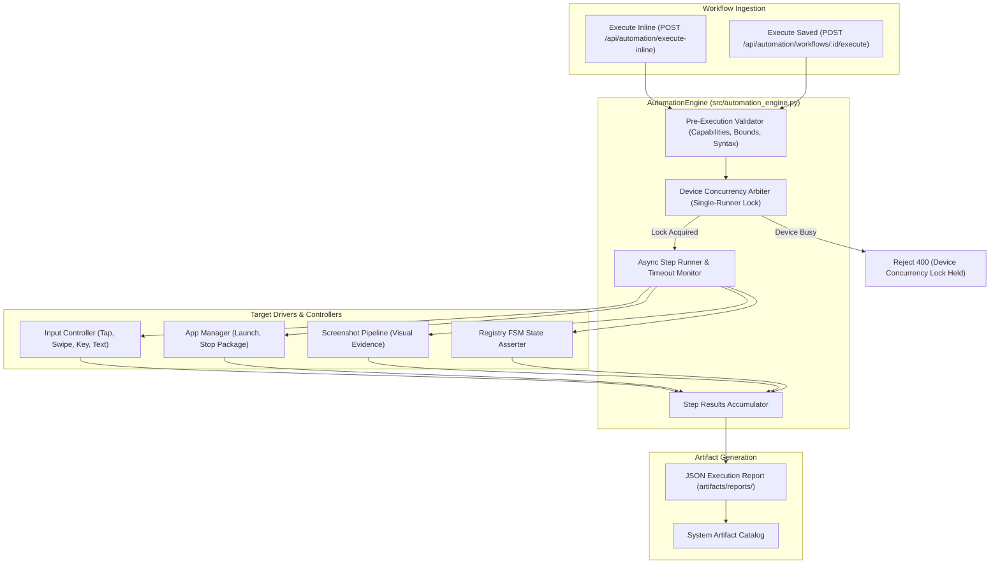

# KELVRA Device Lab — Automation Engine Subsystem

## Document Metadata
- **Document Path:** `Kelvra/KELVRA Device Lab/docs/AUTOMATION_ENGINE.md`
- **Subsystem:** Automation & Observability Subsystem
- **Phase:** Phase 13 — Device Automation, Screenshots, Recordings, Logs & Diagnostics
- **Authority:** Automated Workflow Execution, Concurrency Locking & Assertion Engine
- **Emoji Prohibition Compliance:** 100% verified (0 raw Unicode emojis)

---

## 1. Executive Summary

The Automation Engine is an asynchronous, state-aware execution coordinator that drives declarative automation workflows across connected mobile devices. Workflows execute as sequential, deterministic steps that interact with devices via the `InputController`, capture verification artifacts through the `ArtifactManager`, and evaluate operational assertions against the `DeviceRegistry`.

---

## 2. Engine Architecture & Concurrency Model

---

## 3. Concurrency Protection: Single-Runner Device Locks

To prevent race conditions, overlapping input injection, and test non-determinism, the engine enforces strict **single-execution exclusivity**:
1. When a workflow execution begins on `android:serial_01`, a lock entry `_device_locks["android:serial_01"] = execution_id` is registered.
2. Any concurrent attempt to launch a workflow on the same target device is rejected immediately with HTTP 400 (`"Device is busy executing workflow execution '{active_id}'"`).
3. The lock is released unconditionally inside a `finally` block upon completion, failure, or operator cancellation.

---

## 4. Execution Lifecycle States

- **`RUNNING`:** Active execution. Steps are processed in strict sequential order.
- **`COMPLETED`:** All mandatory steps passed successfully. All assertions verified.
- **`FAILED`:** A mandatory step failed, exceeded its step timeout, or an assertion was violated.
- **`CANCELLED`:** Operator explicitly triggered execution abort via `cancel_execution()`.

---

## 5. Step Execution Guarantees

1. **Step-Level Timeouts:** Each step specifies an optional `timeout_seconds` (defaulting to 15 seconds). Individual steps that hang (e.g. stalled app launch or unresponsive package) are timed out cleanly via `asyncio.wait_for`.
2. **Optional Step Tolerance:** Steps marked with `optional: true` record failures without terminating the entire workflow.
3. **Execution Artifact Persistence:** Upon completion of any workflow, the complete `WorkflowExecutionReport` is serialized to JSON and persisted in `artifacts/reports/` with a reference returned in the response.

---

## 6. REST API Endpoints

- `POST /api/automation/execute-inline`: Validate and execute an ad-hoc workflow definition.
- `GET /api/automation/executions`: List recent workflow executions.
- `GET /api/automation/executions/{execution_id}`: Retrieve detailed step-level execution report.
- `POST /api/automation/executions/{execution_id}/cancel`: Abort an ongoing workflow execution.
- `POST /api/automation/workflows`: Register a reusable workflow template.
- `GET /api/automation/workflows`: List registered workflow templates.
