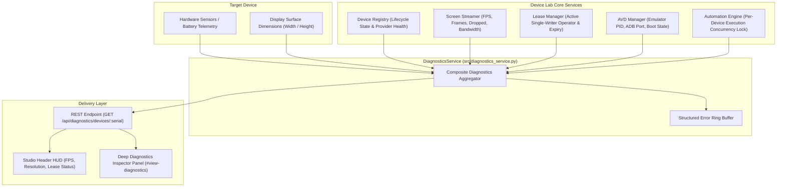

# KELVRA Device Lab — Device Diagnostics Subsystem

## Document Metadata
- **Document Path:** `Kelvra/KELVRA Device Lab/docs/DEVICE_DIAGNOSTICS.md`
- **Subsystem:** Automation & Observability Subsystem
- **Phase:** Phase 13 — Device Automation, Screenshots, Recordings, Logs & Diagnostics
- **Authority:** Host & Hardware Telemetry Aggregation, Health Monitoring & Fault Triage
- **Emoji Prohibition Compliance:** 100% verified (0 raw Unicode emojis)

---

## 1. Executive Summary

The Device Diagnostics Subsystem aggregates multi-layer runtime telemetry across hardware, streaming pipes, lock arbiter leases, and hypervisor orchestrators. In strict compliance with KELVRA design principles, the subsystem **never fabricates or simulates diagnostic metrics**: every reporting field represents a verified, empirically observed runtime state.

---

## 2. Diagnostics Architecture & Telemetry Sources



---

## 3. Telemetry Domain Model (`DeviceDiagnosticReport`)

| Field | Data Type | Source | Description |
| :--- | :--- | :--- | :--- |
| `device_id` | String | Device Registry | Canonical device ID (e.g. `android:10.0.0.12:5555`). |
| `serial` | String | Hardware / Host | Hardware serial number or emulator address. |
| `platform` | String | Provider | Provider platform enum (`android_physical`, `apple_physical`, etc.). |
| `provider_id` | String | Registry | Responsible driver provider identifier. |
| `state` | String | Lifecycle FSM | Active lifecycle state (`available`, `busy`, `unauthorized`, etc.). |
| `battery_level` | Optional[Int] | Hardware Query | Battery charge percentage (0–100%) or `null` if unmonitored. |
| `screen_width` | Optional[Int] | Surface Query | Horizontal resolution in pixels. |
| `screen_height` | Optional[Int] | Surface Query | Vertical resolution in pixels. |
| `stream` | Object | Streamer | Measured FPS, total frames sent, dropped frames, transferred bytes. |
| `lease` | Object | Lease Manager | Lease holder identity, expiration timestamp, countdown seconds. |
| `avd_info` | Optional[Object]| AVD Manager | Emulator running status, adb port, snapshot support. |
| `automation_busy`| Boolean | Automation | Whether an active workflow execution lock is held on this device. |
| `recent_errors` | List[Object] | Registry / Driver | Chronological list of structured errors with timestamps and codes. |

---

## 4. Structured Error Tracking & Fault Triage

Errors encountered during device lifecycle operations, ADB interactions, or streaming handshakes are recorded with structured metadata:
```json
{
  "timestamp": "2026-10-04T05:28:10.450Z",
  "code": "ADB_UNAUTHORIZED",
  "message": "Device RSA host key unconfirmed by device operator",
  "recoverable": true
}
```
This enables operators to immediately diagnose authentication blocks, USB driver dropouts, or Port conflicts without sifting through host console dumps.

---

## 5. REST API Specifications

### 5.1 Query Device Diagnostics
- **Method & Route:** `GET /api/diagnostics/devices/{serial}`
- **Response Status:** `200 OK`
- **Error Status:** `404 Not Found` if device serial is not registered.
