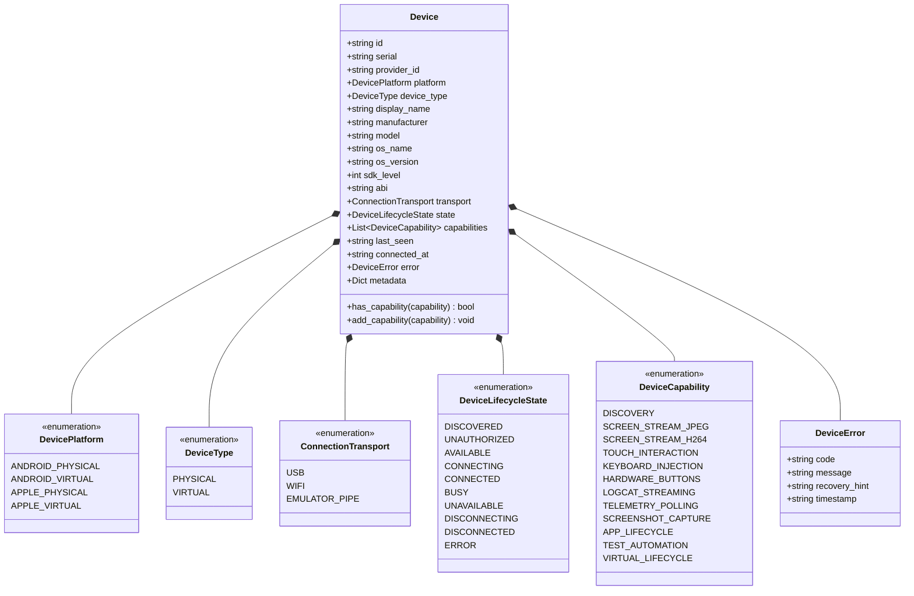

# KELVRA Device Lab — Device Domain Model Specification

## 1. Executive Summary

The Device Domain Model provides the canonical, strongly typed object-oriented representation of physical hardware and virtual mobile devices within KELVRA Device Lab. It strictly adheres to the standalone architecture established in Phase 3 and the Device Provider Contract established in Phase 4.

Stable composite identifiers are enforced across all subsystem boundaries to prevent enumeration drift, transient rename collisions, and race conditions during concurrent multi-operator access.

---

## 2. Core Entities & Class Hierarchy



---

## 3. Stable Identifier Contract

### 3.1 Composite ID Format
Device identifiers strictly adopt the composite scheme:
```
<platform_prefix>:<hardware_serial_or_network_address>
```
Examples:
- `android:8TCABAIFWOZTDICI` (Physical Android USB device)
- `android:192.168.1.105:5555` (Physical Android TCP/IP Wi-Fi device)
- `android:emulator-5554` (Local headless Android Virtual Device)
- `apple:00008101-001234567890ABCD` (Physical iOS device, reserved for Phase 10)

### 3.2 Design Rationale
- **Platform Disambiguation:** Prevents collision between cross-platform devices that might share generic serial strings.
- **Provider Resolution:** The prefix immediately indicates the owning provider subsystem without requiring registry lookups.
- **Immutability:** Hardware serials and network tuples remain constant during session lifecycle transitions, unlike display names or transient session tokens.

---

## 4. Hardware Capability Enumeration

Hardware capabilities are reported discretely to ensure clients fail-fast before invoking unsupported hardware operations:

| Capability | Description | Verification Method |
| :--- | :--- | :--- |
| `DISCOVERY` | Device was detected on bus | Provider polling loop |
| `SCREEN_STREAM_JPEG` | JPEG frame capture supported | Framegrabber pipeline |
| `SCREEN_STREAM_H264` | Native H.264 video encoding | Hardware encoder probe (scrcpy) |
| `TOUCH_INTERACTION` | Multi-touch coordinate injection | Linux `/dev/input` or `adb shell input tap` |
| `KEYBOARD_INJECTION` | Text and keyevent injection | `adb shell input text` / `input keyevent` |
| `HARDWARE_BUTTONS` | Power, volume, home buttons | Hardware key event codes |
| `LOGCAT_STREAMING` | Real-time system log streaming | Logcat circular buffer socket |
| `TELEMETRY_POLLING` | CPU, RAM, battery metrics | Sysfs and dumpsys battery/cpuinfo |
| `SCREENSHOT_CAPTURE` | High-resolution bitmap capture | Framebuffer dump or screencap |
| `APP_LIFECYCLE` | Package install/launch/stop | PackageManager and ActivityManager |
| `TEST_AUTOMATION` | Automated test runner harness | TestRunner orchestrator |
| `VIRTUAL_LIFECYCLE` | Start, pause, snapshot, kill | AVD / Emulator process manager |

---

## 5. Serialization and Validation Rules

1. **Non-Empty Serials:** Whitespace-only or blank serial strings trigger immediate validation exceptions (`ValueError`).
2. **Deterministic JSON Schema:** All timestamp fields serialize to standard UTC ISO-8601 strings (`YYYY-MM-DDTHH:MM:SS.mmmmmm+00:00`).
3. **Pydantic Model Security:** Device inputs cannot contain unexpected fields; metadata is explicitly partitioned in a typed `metadata` dictionary to prevent prototype pollution or parameter tampering.
