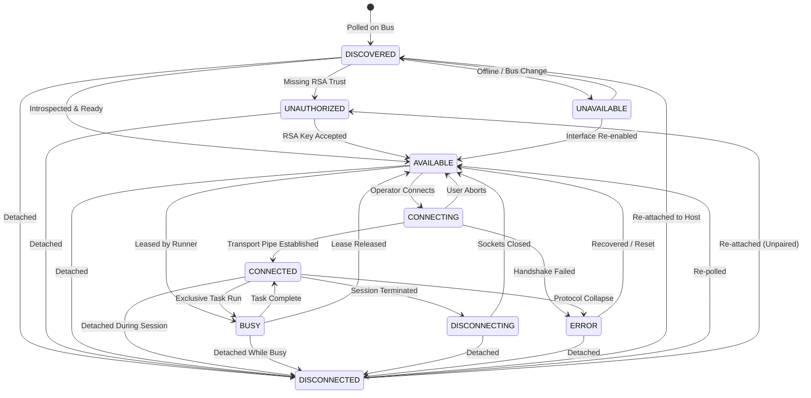

# KELVRA Device Lab — Connection Lifecycle State Machine Specification

## 1. Overview

KELVRA Device Lab enforces a strict, deterministic 10-state finite state machine (FSM) governing every physical and virtual device enrolled in the system. State transitions are strictly validated at runtime; any illegal transition raises `InvalidLifecycleTransitionError` to guarantee safety, session lease integrity, and predictable telemetry collection.

---

## 2. State Machine Diagram

---

## 3. Transition Rules Table

The following matrix documents the exact transitions permitted by `can_transition()` and executed by `transition_device()`:

| Current State | Permitted Target States | Description |
| :--- | :--- | :--- |
| `DISCOVERED` | `UNAUTHORIZED`, `AVAILABLE`, `UNAVAILABLE`, `DISCONNECTED`, `ERROR` | Initial discovery on host bus |
| `UNAUTHORIZED` | `AVAILABLE`, `DISCOVERED`, `UNAVAILABLE`, `DISCONNECTED`, `ERROR` | Awaiting USB debugging authorization prompt |
| `AVAILABLE` | `CONNECTING`, `BUSY`, `UNAVAILABLE`, `DISCONNECTED`, `ERROR` | Idle, healthy, and ready for operator session |
| `CONNECTING` | `CONNECTED`, `AVAILABLE`, `UNAVAILABLE`, `DISCONNECTED`, `ERROR` | Socket handshake and framegrabber bootstrap |
| `CONNECTED` | `BUSY`, `DISCONNECTING`, `UNAVAILABLE`, `DISCONNECTED`, `ERROR` | Active live interactive session |
| `BUSY` | `CONNECTED`, `AVAILABLE`, `UNAVAILABLE`, `DISCONNECTED`, `ERROR` | Autonomous automation or benchmark running |
| `DISCONNECTING`| `AVAILABLE`, `DISCONNECTED`, `ERROR` | Tearing down sockets and process handles |
| `UNAVAILABLE` | `DISCOVERED`, `AVAILABLE`, `UNAUTHORIZED`, `DISCONNECTED`, `ERROR` | Hardware offline or disabled |
| `DISCONNECTED` | `DISCOVERED`, `AVAILABLE`, `UNAUTHORIZED`, `ERROR` | Detached or removed from host |
| `ERROR` | `AVAILABLE`, `DISCOVERED`, `DISCONNECTED` | Trapped error requiring recovery |

*Note: Self-transitions (e.g. `AVAILABLE -> AVAILABLE`) are treated as idempotent re-affirmations and are permitted.*

---

## 4. Timestamps and Error Handling

1. **`connected_at` Precision:** When a device transitions to `CONNECTED`, its `connected_at` timestamp is populated with current UTC time in ISO-8601 format. When returning to `AVAILABLE`, `DISCONNECTING`, or `DISCONNECTED`, `connected_at` is set to `None`.
2. **Error Attachment:** An error payload (`DeviceError`) can be attached during any transition to `ERROR` or `UNAUTHORIZED`.
3. **Automatic Error Clearance:** Transitioning to `AVAILABLE` or `CONNECTED` clears all prior errors, confirming recovery.
