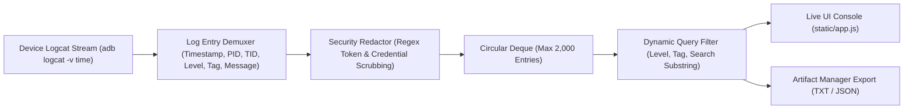

# KELVRA Device Lab — Device Logging Subsystem

## Document Metadata
- **Document Path:** `Kelvra/KELVRA Device Lab/docs/DEVICE_LOGGING.md`
- **Subsystem:** Automation & Observability Subsystem
- **Phase:** Phase 13 — Device Automation, Screenshots, Recordings, Logs & Diagnostics
- **Authority:** Log Streaming, Circular Buffer, Redaction & Audit Export
- **Emoji Prohibition Compliance:** 100% verified (0 raw Unicode emojis)

---

## 1. Executive Summary

The Device Logging Subsystem captures, sanitizes, buffers, and exports diagnostic log output from attached devices. Because mobile logs frequently record sensitive operational telemetry—including OAuth access tokens, passwords entered via accessibility APIs, and user identifiers—the subsystem applies strict inline credential scrubbing before any line enters memory buffers or is returned to client interfaces.

---

## 2. In-Memory Circular Buffer Architecture

To prevent unbounded heap expansion on long-running workstation hosts, `src/logcat_service.py` allocates a fixed-size `collections.deque(maxlen=2000)` per attached device:

---

## 3. Inline Security & Credential Redaction

Every log line is processed through `sanitize_log_message()` prior to ingestion:

### 3.1 Scrubbing Rules
1. **Bearer & Authorization Tokens:**
   - Pattern: `(?i)(bearer\s+)([a-zA-Z0-9_\-\.]{10,})`
   - Replacement: `Bearer [REDACTED_TOKEN]`
2. **Key-Value Credentials & Passwords:**
   - Pattern: `(?i)(password|passwd|secret|api[_\-]?key|auth[_\-]?token|session[_\-]?token)\s*[:=]\s*([^\s,;]+)`
   - Replacement: `$1=[REDACTED_SECRET]`
3. **Session & JWT Hex Tokens:**
   - Pattern: `\b[a-f0-9]{32,64}\b`
   - Replacement: `[REDACTED_HEX]`

---

## 4. Query Filtering & Level Taxonomy

Logs are filtered dynamically on query execution without modifying buffer contents:

| Level Flag | Severity | Color Code in Console | Inclusion Rule |
| :--- | :--- | :--- | :--- |
| `V` | VERBOSE | Muted Gray (`#736F66`) | Included only when Level is `ALL` or `VERBOSE` |
| `D` | DEBUG | Cyan Blue (`#60A5FA`) | Included for `DEBUG` and above |
| `I` | INFO | Accent Green (`#10B981`) | Default baseline filter |
| `W` | WARN | Amber Warning (`#F59E0B`) | High-priority warnings |
| `E` | ERROR | Coral Red (`#EF4444`) | Runtime errors and exceptions |
| `F` | FATAL | Dark Red (`#DC2626`) | Uncaught crashes, SIGSEGV, ANR |

---

## 5. Artifact Export Engine

Clients can download filtered log snapshots on demand:
- **Plaintext Format (`format=txt`):** Standard logcat format suitable for grep and terminal analysis:
  `2026-10-04 05:25:00.123 I/ActivityManager( 1204): Displayed com.android.settings/.Settings: +240ms`
- **JSON Format (`format=json`):** Structured array of typed `LogEntry` records persisted into `artifacts/logs/` and cataloged in the system artifact database.

---

## 6. REST API Endpoints

- `GET /api/devices/{serial}/logs`: Query live entries with `level`, `tag`, `search`, and `limit`.
- `DELETE /api/devices/{serial}/logs`: Clear the device's circular buffer.
- `GET /api/devices/{serial}/logs/export`: Generate a downloadable text or JSON artifact.
