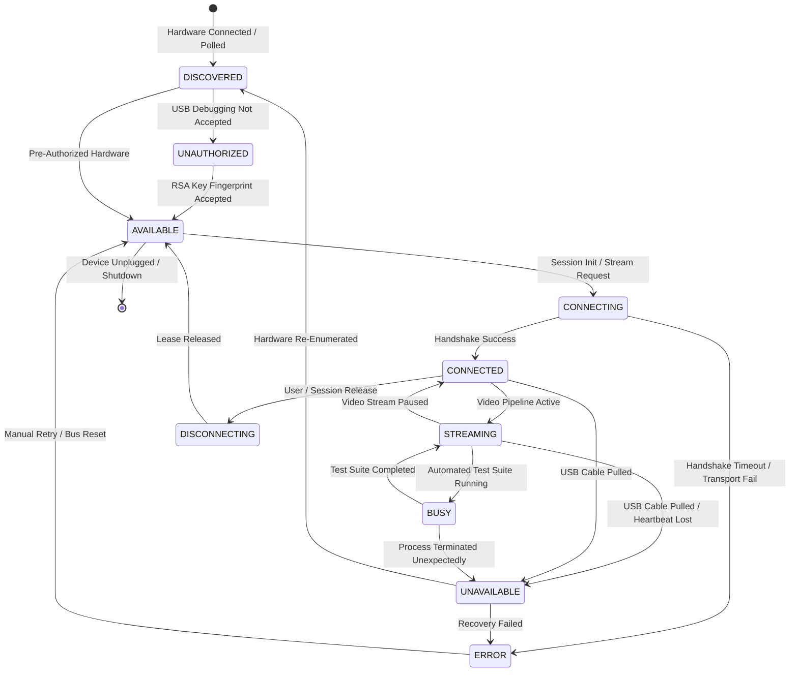

# KELVRA Device Lab — Device Provider Contract & Lifecycle State Machine

## Document Metadata
- **Document Path:** `Kelvra/KELVRA Device Lab/docs/DEVICE_PROVIDER_CONTRACT.md`
- **Subsystem:** KELVRA Device Lab
- **Phase:** Phase 3 — System Architecture, Technical Decisions & Engineering Blueprint
- **Authority:** Device Abstraction Layer & Provider Specification
- **Emoji Prohibition Compliance:** 100% verified (0 raw Unicode emojis)

---

## 1. Provider Design Principles

To prevent platform cross-contamination and support heterogeneous mobile devices without leaky abstractions:
1. **Dynamic Capability Declaration:** Rather than assuming universal support, each provider explicitly declares its supported capabilities via `get_capabilities()`.
2. **Strict Encapsulation:** All toolchain-specific commands (`adb`, `usbmuxd`, `emulator`) are fully encapsulated inside concrete providers.
3. **Fail-Closed Execution:** If a provider does not support an operation (e.g. touch injection on an iOS device on Windows), it immediately raises `UnsupportedCapabilityError` rather than fabricating simulated success.
4. **Isolated Error Propagation:** A failure in an Android emulator provider does not crash the server or affect connected physical devices.

---

## 2. Canonical Device Connection Lifecycle State Machine

Every managed device transitions through a strict, deterministic finite state machine (FSM):



### 2.1 State Definitions
- `DISCOVERED`: Device detected on physical bus or network; metadata query pending.
- `UNAUTHORIZED`: Device connected but ADB RSA key is not yet confirmed on physical display.
- `AVAILABLE`: Device authorized, online, idle, and ready for teleoperation or test lease.
- `CONNECTING`: Initializing communication sockets and stream pipelines.
- `CONNECTED`: Session established; device ready for control commands.
- `STREAMING`: Video capture pipeline actively transmitting frames to clients.
- `BUSY`: Exclusive execution lock held by an automated test runner.
- `UNAVAILABLE`: Transient communication loss or physical cable disconnected during active session.
- `ERROR`: Irrecoverable provider error requiring manual intervention or reconnect.
- `DISCONNECTING`: Gracefully closing sockets and releasing leases.

---

## 3. Abstract Provider Interface Contract (`BaseDeviceProvider`)

Below is the definitive Python 3.13 interface contract implemented by all providers:

```python
from abc import ABC, abstractmethod
from typing import AsyncGenerator, Dict, Any, List, Optional
from dataclasses import dataclass
from enum import Enum

class DevicePlatform(str, Enum):
    ANDROID_PHYSICAL = "android_physical"
    ANDROID_VIRTUAL = "android_virtual"
    APPLE_PHYSICAL = "apple_physical"
    APPLE_VIRTUAL = "apple_virtual"

class DeviceCapability(str, Enum):
    SCREEN_STREAM_JPEG = "screen_stream_jpeg"
    SCREEN_STREAM_H264 = "screen_stream_h264"
    TOUCH_INTERACTION = "touch_interaction"
    KEYBOARD_INJECTION = "keyboard_injection"
    HARDWARE_BUTTONS = "hardware_buttons"
    LOGCAT_STREAMING = "logcat_streaming"
    TELEMETRY_POLLING = "telemetry_polling"
    SCREENSHOT_CAPTURE = "screenshot_capture"
    APP_LIFECYCLE = "app_lifecycle"
    TEST_AUTOMATION = "test_automation"
    VIRTUAL_LIFECYCLE = "virtual_lifecycle"

@dataclass
class DeviceMetadata:
    serial: str
    manufacturer: str
    model: str
    platform: DevicePlatform
    os_version: str
    api_level: int
    resolution: str
    dpi: int
    abi: str
    is_virtual: bool

@dataclass
class TelemetrySnapshot:
    cpu_usage_pct: float
    ram_used_mb: int
    ram_total_mb: int
    storage_free_gb: float
    battery_pct: int
    is_charging: bool
    temperature_c: float

class BaseDeviceProvider(ABC):
    """Abstract Base Class for all KELVRA Device Lab device adapters."""

    def __init__(self, serial: str):
        self.serial = serial

    @abstractmethod
    def get_platform(self) -> DevicePlatform:
        """Return the target platform category."""
        pass

    @abstractmethod
    def get_capabilities(self) -> List[DeviceCapability]:
        """Return list of explicitly supported capabilities."""
        pass

    @abstractmethod
    async def get_metadata(self) -> DeviceMetadata:
        """Query and return full hardware specifications."""
        pass

    @abstractmethod
    async def get_telemetry(self) -> TelemetrySnapshot:
        """Poll and return current health and performance metrics."""
        pass

    @abstractmethod
    async def capture_screenshot(self) -> bytes:
        """Capture and return raw uncompressed PNG image bytes."""
        pass

    @abstractmethod
    async def stream_frames(self, quality: str = "high") -> AsyncGenerator[bytes, None]:
        """Yield continuous binary video frames (JPEG or H.264 NAL)."""
        pass

    @abstractmethod
    async def inject_tap(self, x: int, y: int) -> bool:
        """Inject touch tap at physical pixel coordinates."""
        pass

    @abstractmethod
    async def inject_swipe(self, x1: int, y1: int, x2: int, y2: int, duration_ms: int) -> bool:
        """Inject touch swipe gesture."""
        pass

    @abstractmethod
    async def inject_key(self, key_code: int) -> bool:
        """Inject hardware key event."""
        pass

    @abstractmethod
    async def inject_text(self, text: str) -> bool:
        """Inject sanitized text string into focused input."""
        pass

    @abstractmethod
    async def install_app(self, package_path: str) -> bool:
        """Install application package (APK/IPA)."""
        pass

    @abstractmethod
    async def launch_app(self, package_name: str) -> bool:
        """Bring application package to the foreground."""
        pass

    @abstractmethod
    async def stop_app(self, package_name: str) -> bool:
        """Force terminate application package."""
        pass

    @abstractmethod
    async def stream_logs(self) -> AsyncGenerator[Dict[str, Any], None]:
        """Yield structured real-time diagnostic log lines."""
        pass

    @abstractmethod
    async def close(self) -> None:
        """Release all allocated sockets, subprocesses, and temporary files."""
        pass
```

---

## 4. Concrete Provider Implementations & Capability Mapping

| Concrete Provider | Underlying Tools | Declared Capabilities |
|---|---|---|
| **`AndroidPhysicalProvider`** | ADB Server socket (`5037`), `dumpsys`, `input`, `scrcpy-server` | All 10 Android capabilities (`SCREEN_STREAM_JPEG`, `SCREEN_STREAM_H264`, `TOUCH_INTERACTION`, `KEYBOARD_INJECTION`, `HARDWARE_BUTTONS`, `LOGCAT_STREAMING`, `TELEMETRY_POLLING`, `SCREENSHOT_CAPTURE`, `APP_LIFECYCLE`, `TEST_AUTOMATION`). |
| **`AndroidVirtualProvider`** | Android SDK `emulator`, `avdmanager`, QEMU console | Same as physical plus `VIRTUAL_LIFECYCLE` (boot, snapshot, shutdown). Synthetic battery/thermals. |
| **`ApplePhysicalProvider`** | `pymobiledevice3`, `usbmuxd` service | `SCREENSHOT_CAPTURE`, `TELEMETRY_POLLING` (battery/thermals), `LOGCAT_STREAMING` (syslog), `APP_LIFECYCLE` (developer IPA install). Touch teleoperation is excluded on Windows host. |
