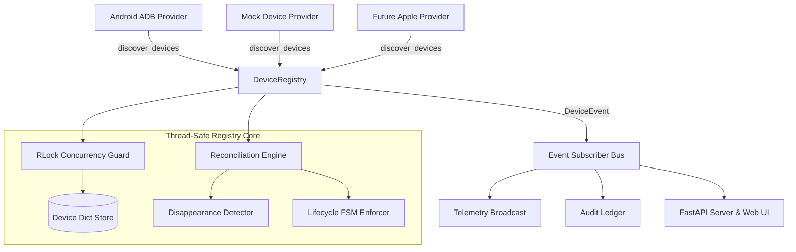

# KELVRA Device Lab — Device Registry Specification

## 1. Overview

The `DeviceRegistry` is the centralized, in-memory, thread-safe repository managing all mobile hardware devices, emulators, and virtual instances enrolled in KELVRA Device Lab. It coordinates multi-provider polling, resolves composite device IDs, detects hardware detachments, enforces lifecycle state transitions, and dispatches real-time state change events to interested subscribers.

---

## 2. Architectural Responsibilities

---

## 3. Concurrency & Thread-Safety

- **Reentrant Mutex Guard:** All write operations (`register_provider`, `reconcile_discovered_devices`, `connect_device`, `disconnect_device`) and read queries (`get_device`, `list_devices`, `get_stats`) are guarded by `threading.RLock()`.
- **Copy on Read:** Query methods return deep copies (`model_copy()`) of `Device` instances, preventing callers from mutating internal registry state outside transaction locks.
- **Subscriber Isolation:** Event callbacks are executed within protected `try...except` blocks to prevent third-party exceptions from crashing the registry loop.

---

## 4. Reconciliation and Disappearance Detection

On each polling interval (default 5.0 seconds), the registry triggers `poll_all_providers()`:
1. **New Device Discovery:** Newly recognized composite IDs are registered in `state=DISCOVERED` or `state=AVAILABLE` and emit `DEVICE_DISCOVERED` events.
2. **Property Updates:** Existing devices update their volatile hardware properties (OS version, battery, capabilities) and update their `last_seen` timestamp.
3. **Disappearance Detection:** Any device previously registered by a specific provider that is not present in that provider's latest poll is flagged as detached. It transitions to `DeviceLifecycleState.DISCONNECTED` with code `DEVICE_DISAPPEARED` and emits `DEVICE_DISCONNECTED`.

---

## 5. Fleet Statistics Aggregation

The registry provides an atomic `get_stats()` method providing instant fleet health metrics:
- `total`: Total known devices enrolled.
- `online`: Devices currently available, connected, or busy.
- `connected`: Devices with active operator streaming sessions.
- `unauthorized`: Attached devices waiting for physical screen unlock / RSA approval.
- `busy`: Devices running automated test suites or benchmarks.
