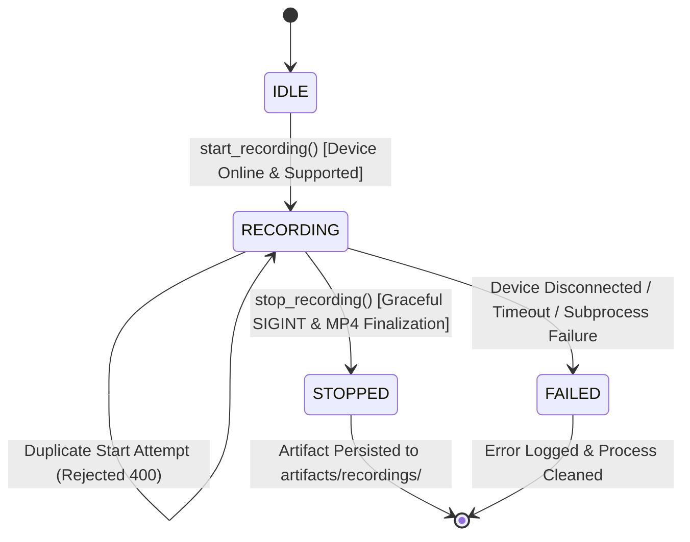
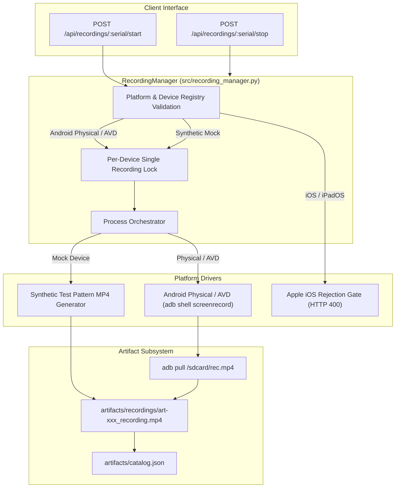

# KELVRA Device Lab — Screen Recording Subsystem

## Document Metadata
- **Document Path:** `Kelvra/KELVRA Device Lab/docs/RECORDING_SESSIONS.md`
- **Subsystem:** Automation & Observability Subsystem
- **Phase:** Phase 13 — Device Automation, Screenshots, Recordings, Logs & Diagnostics
- **Authority:** Video Recording Lifecycle & Session Management
- **Emoji Prohibition Compliance:** 100% verified (0 raw Unicode emojis)

---

## 1. Executive Summary

The Screen Recording Subsystem orchestrates time-bounded, hardware-accelerated video recording sessions of connected mobile devices. Unlike transient live streaming frames, recording sessions produce self-contained, high-definition MP4 artifacts suitable for test failure regression reports, compliance audits, and bug reproduction.

---

## 2. Session Lifecycle State Machine

Each device maintains an independent, strictly single-writer recording lifecycle governed by `src/recording_manager.py`:



### 2.1 State Definitions
- **`IDLE`:** Device has no active recording process. Ready for session initialization.
- **`RECORDING`:** Subprocess active. Target device is capturing frames to internal storage.
- **`STOPPED`:** Graceful finalization invoked. Video file pulled to workstation host and cataloged.
- **`FAILED`:** Unexpected disruption encountered (e.g. physical USB disconnection, ADB socket crash).

---

## 3. Platform Capabilities & Implementation Architecture



### 3.1 Android Host Mechanism
- **Command:** `adb -s {serial} shell screenrecord --bit-rate {bitrate} --time-limit {duration} /sdcard/kelvra_rec_{session_id}.mp4`
- **Graceful Finalization:** The `screenrecord` binary requires clean termination (`SIGINT` or ADB kill signal) to properly write the MPEG-4 `moov` atom containing frame index metadata. Forceful killing (`SIGKILL`) corrupts the container header, rendering the video unplayable.
- **Pull & Cleanup:** Once stopped, the file is retrieved using `adb pull` to `artifacts/recordings/` and deleted from device `/sdcard/`.

### 3.2 Apple iOS / iPadOS Rejection
- Screen recording on iOS from a Windows host without native QuickTime AVFoundation services requires proprietary screen mirroring daemons. KELVRA Device Lab enforces honest reporting: any start attempt targeting an Apple device is rejected immediately with HTTP 400:
  `"Screen recording is not supported for iOS/iPadOS devices on Windows host (requires macOS AVFoundation/QuickTime capture pipeline)."`

---

## 4. Hardware Disconnect Resilience

If an attached device experiences an unexpected hardware disconnection during active recording:
1. `RecordingManager.handle_device_disconnected(serial)` is triggered immediately by registry listener or WebSocket disconnect event.
2. The running ADB process is terminated.
3. The recording state transitions directly to `FAILED`.
4. The error reason is explicitly recorded (`"Device disconnected while recording was active"`).
5. Partial or corrupted temporary files are pruned to prevent orphaned storage leaks.

---

## 5. REST API Specifications

### 5.1 Start Recording
- **Method & Route:** `POST /api/recordings/{serial}/start`
- **Request Body:**
  ```json
  {
    "max_duration_seconds": 180,
    "bit_rate_mbps": 4
  }
  ```
- **Response Status:** `200 OK`

### 5.2 Stop Recording
- **Method & Route:** `POST /api/recordings/{serial}/stop`
- **Response Status:** `200 OK`
- **Response Schema:**
  ```json
  {
    "session_id": "rec-5b72e10a",
    "serial": "MOCK_P13_01",
    "state": "STOPPED",
    "artifact_id": "art-89f412ba78c9",
    "file_size_bytes": 1284500,
    "download_url": "/api/artifacts/art-89f412ba78c9/download"
  }
  ```

### 5.3 Active Recording Status
- **Method & Route:** `GET /api/recordings/{serial}/status`
- **Response Status:** `200 OK`
