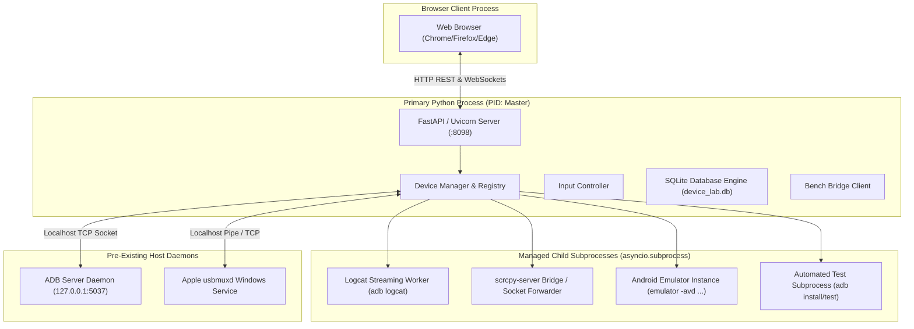

# KELVRA Device Lab — Process & Runtime Topology

## Document Metadata
- **Document Path:** `Kelvra/KELVRA Device Lab/docs/RUNTIME_TOPOLOGY.md`
- **Subsystem:** KELVRA Device Lab
- **Phase:** Phase 3 — System Architecture, Technical Decisions & Engineering Blueprint
- **Host Context:** Windows 10/11 Developer Workstation
- **Emoji Prohibition Compliance:** 100% verified (0 raw Unicode emojis)

---

## 1. Process Architecture Overview

Device Lab is structured as a single primary application process managing a family of isolated child worker subprocesses. This design guarantees high modularity and fault isolation while avoiding the operational friction of distributed microservices.



---

## 2. Process Partitioning & Concurrency Boundaries

### 2.1 In-Process Components (Primary Python Process)
- **FastAPI / Uvicorn Server:** Runs the asynchronous event loop on port `:8098`.
- **Device Registry & State Machine:** Manages in-memory state, lease locks, and active sessions.
- **Input Coordinate Transformation:** Calculates math and normalizes coordinates in-process (< 1ms).
- **SQLite Engine:** Runs embedded SQLite queries with WAL mode without IPC overhead.
- **Frame Rate Controller:** Handles frame queuing and backpressure dropping in-memory.

### 2.2 Separate Child Subprocesses
- **ADB Logcat Streamer:** Spawns `adb -s <serial> logcat` as a dedicated subprocess. Isolates the server from high-velocity stdout bursts.
- **Screen Streaming Worker (scrcpy Adapter):** Spawns `scrcpy-server` or ADB frame capture in a dedicated subprocess with its own stdout/stderr pipes.
- **Android Virtual Device (AVD):** When an emulator is launched, it runs in its own isolated QEMU process (`emulator.exe`).
- **Test Runner Execution:** APK installations and long-running shell scripts execute in bounded worker subprocesses with strict timeouts.

---

## 3. Privilege Model: Least Privilege Enforcement

- **Zero Elevated Privileges:** Device Lab runs strictly as a standard, non-elevated user process. It does **not** require Administrator privileges on Windows or root on Linux.
- **No System Partition Modifications:** All device commands run against user-space partitions (`/data/local/tmp`, `/sdcard`); `/system` mounts remain untouched.
- **Loopback Binding Only:** By default, Device Lab binds exclusively to `127.0.0.1:8098` (localhost), preventing unauthorized remote network access.

---

## 4. Subprocess Lifecycle, Crash Detection & Orphan Prevention

### 4.1 Windows Process Creation Flags
All child subprocesses are spawned using explicit creation flags to ensure non-intrusive operation:
```python
# Windows creation flag preventing flashing CMD console windows
CREATE_NO_WINDOW = 0x08000000

process = await asyncio.create_subprocess_exec(
    *cmd,
    stdout=asyncio.subprocess.PIPE,
    stderr=asyncio.subprocess.PIPE,
    creationflags=CREATE_NO_WINDOW
)
```

### 4.2 Orphan Prevention Mechanism
To prevent runaway background processes when Device Lab restarts or crashes:
1. **PID Registration:** Every spawned subprocess PID is registered in an active process registry (`_active_subprocesses: set[int]`).
2. **Process Tree Termination on Exit:** An `atexit` handler and FastAPI shutdown event iterate through all registered child PIDs and dispatch `SIGTERM` followed by `SIGKILL` (via Windows `taskkill /F /T /PID <pid>`) to terminate entire process subtrees.
3. **Windows Job Object Binding (Release 1.x):** Grouping spawned processes under a Windows Job Object configured with `JOB_OBJECT_LIMIT_KILL_ON_JOB_CLOSE`, ensuring that if the parent Python process terminates unexpectedly, the OS automatically reaps all child processes.

### 4.3 Subprocess Crash Detection
- Asynchronous stream readers monitor stdout EOF. If a worker process exits prematurely, an exit code listener triggers an immediate state transition in `DeviceManager` (`STREAMING -> ONLINE` or `ERROR`) and alerts the connected WebSocket client.

---

## 5. Application Startup & Graceful Shutdown Sequences

### 5.1 Startup Sequence
1. Bind FastAPI server to `127.0.0.1:8098`.
2. Initialize SQLite database and run migration schema check.
3. Verify host toolchains (`adb.exe` on PATH, ADB server running on port `5037`).
4. Trigger initial fleet discovery scan.
5. Launch background telemetry poller loop (3s cadence).

### 5.2 Graceful Shutdown Sequence
1. Reject new incoming HTTP requests (503 Service Unavailable).
2. Broadcast `SERVER_SHUTDOWN` event to all active WebSocket clients.
3. Terminate all active screen streaming loops and close video sockets.
4. Terminate all active logcat streaming subprocesses.
5. Release all active device reservation leases.
6. Commit pending database transactions and checkpoint WAL file.
7. Terminate any remaining registered child subprocesses.
8. Clean exit within <= 1.5 seconds.
