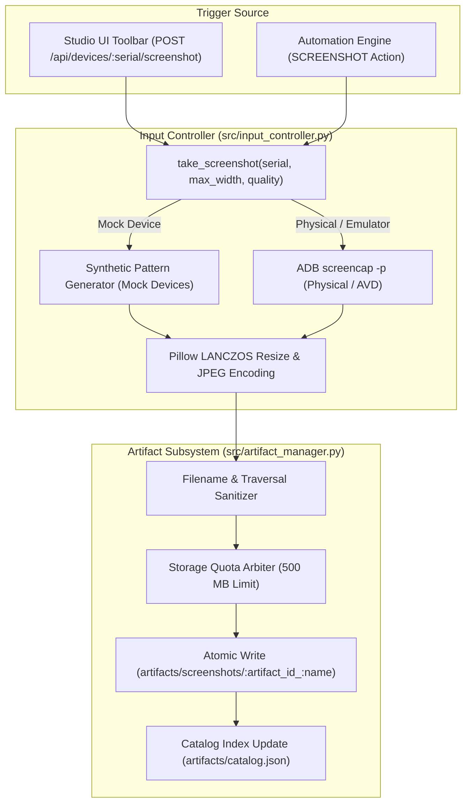

# KELVRA Device Lab — Screenshot Capture Subsystem

## Document Metadata
- **Document Path:** `Kelvra/KELVRA Device Lab/docs/SCREENSHOT_CAPTURE.md`
- **Subsystem:** Automation & Observability Subsystem
- **Phase:** Phase 13 — Device Automation, Screenshots, Recordings, Logs & Diagnostics
- **Authority:** Visual Inspection, Static Frame Capture & Artifact Pipeline
- **Emoji Prohibition Compliance:** 100% verified (0 raw Unicode emojis)

---

## 1. Executive Summary

The Screenshot Capture subsystem provides deterministic, low-latency, and authenticated capture of visual frames from connected physical and virtual mobile devices. Captured frames serve dual roles:
1. **Interactive Operator Inspection:** On-demand frame verification and forensic debugging from the Device Viewer Studio toolbar.
2. **Automated Assertion Evidence:** Step-level visual verification artifacts captured during automated workflow execution.

All captured screenshots are systematically persisted through the thread-safe `ArtifactManager`, indexed into an atomic JSON catalog, sanitized against path traversal vulnerabilities, and constrained by a global 500 MB quota with Least-Recently-Used (LRU) pruning.

---

## 2. Architecture & Capture Pipeline



---

## 3. Image Processing & Compression Standards

### 3.1 Format Selection
- **Default Format:** JPEG (`image/jpeg`). Provides 85% to 92% compression savings over uncompressed RGBA framebuffers while retaining visual fidelity required for OCR and visual diff assertions.
- **Optional Raw Format:** PNG (`image/png`). Used when bit-exact pixel comparisons or alpha transparency are explicitly required.

### 3.2 Resolution Normalization & Aspect Ratio Preservation
Mobile devices present native display resolutions up to 3840x2160 (4K). Storing unscaled full-resolution frames creates unnecessary I/O overhead and rapid storage quota exhaustion.
- **Max Width Constraint:** Defaults to 1080 pixels.
- **Downsampling Algorithm:** `Image.Resampling.LANCZOS` high-order sinc interpolation to prevent moiré patterns and jagged text artifacts.
- **Quality Factor:** 75% baseline (Studio and Automation) or configurable up to 95% via request parameter.

---

## 4. Platform Capability Matrix & Truthful Reporting

| Platform | Capture Support | Implementation Mechanism | Constraints & Limitations |
| :--- | :--- | :--- | :--- |
| **Android Physical** | Supported | `adb -s {serial} exec-out screencap -p` | Requires device in `AVAILABLE` or `BUSY` state with authorized ADB RSA key. |
| **Android Virtual (AVD)** | Supported | `adb -s {serial} exec-out screencap -p` | Supported on both headless and GUI-accelerated emulator instances. |
| **Apple iOS / iPadOS** | Not Supported | Rejected (HTTP 400 Bad Request) | Windows workstation host lacks ideviceimagemounter / DDI developer image mounting tools. Honest capability rejection without simulation. |
| **Synthetic Mock Device** | Supported | In-memory Pillow RGB canvas generator | Dedicated test pattern for continuous integration and deterministic verification. |

---

## 5. REST API Specifications

### 5.1 Capture Screenshot
- **Method & Route:** `POST /api/devices/{serial}/screenshot`
- **Query Parameters:**
  - `format`: `jpeg` (default) or `png`
  - `quality`: Integer from 1 to 100 (default: 80)
- **Response Status:** `200 OK`
- **Response Schema:**
  ```json
  {
    "artifact_id": "art-7f9a1c83d2e4",
    "name": "screenshot_MOCK_P13_01_1728000000.jpeg",
    "artifact_type": "screenshot",
    "file_format": "jpeg",
    "device_id": "android:MOCK_P13_01",
    "created_at": "2026-10-04T05:20:00.123456Z",
    "file_size_bytes": 45120,
    "relative_path": "screenshots/art-7f9a1c83d2e4_screenshot_MOCK_P13_01_1728000000.jpeg",
    "download_url": "/api/artifacts/art-7f9a1c83d2e4/download"
  }
  ```

### 5.2 List Device Screenshots
- **Method & Route:** `GET /api/devices/{serial}/screenshots`
- **Response Status:** `200 OK`
- **Response Schema:** JSON Array of `ArtifactRecord` objects filtered to `device_id` and `artifact_type=screenshot`.
