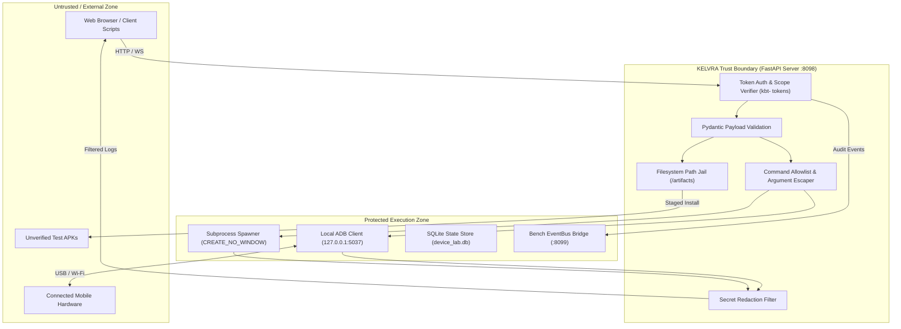

# KELVRA Device Lab — Security Architecture & Threat Model

## Document Metadata
- **Document Path:** `Kelvra/KELVRA Device Lab/docs/SECURITY_ARCHITECTURE.md`
- **Subsystem:** KELVRA Device Lab
- **Phase:** Phase 3 — System Architecture, Technical Decisions & Engineering Blueprint
- **Authority:** KELVRA Security Governance (`kelvra-security` / `kelvra-ward`)
- **Emoji Prohibition Compliance:** 100% verified (0 raw Unicode emojis)

---

## 1. Security Philosophy & Trust Boundaries

Device Lab operates as a trusted local engineering console interfacing with untrusted mobile hardware and potentially untrusted test applications. 

KELVRA remains the central source of truth for global authorization and execution policies. Device Lab adheres to three core security principles:
1. **Never Bypass Platform Security:** OS-level Keystore, hardware secure enclaves, and system permission gates are respected without exception.
2. **Zero Shell String Concatenation:** All commands executed on the host or inside the device shell are invoked with strict, structured argument lists (`shell=False`) and explicit command allowlists.
3. **Exterior Authorization Enforcement:** Security checks are enforced strictly on the backend application boundary; frontend clients cannot bypass controls.



---

## 2. Threat Analysis & Mitigation Matrix

| Threat ID | Threat Vector | Impact | Architectural Mitigation |
|---|---|---|---|
| **T-01** | Command Injection via Text Input | Host or device arbitrary code execution | Shell string concatenation is strictly forbidden (`shell=False`). Text typing inputs are sanitized by rejecting or escaping shell metacharacters (`;`, `&`, `|`, `` ` ``, `$`, `\n`). |
| **T-02** | Path Traversal during APK Upload / Log Export | Arbitrary file read/write on host | All file paths are resolved and validated against a canonical directory jail (`artifacts/evidence/`). Paths containing `..` or leading slashes outside the jail are rejected. |
| **T-03** | Secret Leakage in Logcat Stream | API keys, Bearer tokens, or passwords exposed in logs | Automated streaming regex filter scans every logcat line and replaces detected credentials with `[REDACTED_SECRET]` before transmission. |
| **T-04** | Accidental System Package Modification | Brick or corrupt physical test hardware | Package manager operations (`pm uninstall`, `pm clear`) enforce a hard denylist protecting all system packages (`/system/app`, `/system/priv-app`). |
| **T-05** | Remote Network Hijacking | Unauthorized attacker controlling phone on LAN | Device Lab binds strictly to localhost loopback (`127.0.0.1:8098`). Remote network binding requires explicit CLI configuration and token authentication. |
| **T-06** | Zombie Subprocess Exhaustion | Host CPU/RAM denial of service | Managed child subprocesses are tracked in an active PID registry and terminated via Windows Job Objects and `atexit` teardown handlers. |

---

## 3. Command Allowlisting & Shell Safety

Device Lab executes mobile commands exclusively through predefined command templates:

```python
# ALLOWED COMMAND PATTERNS (Whitelisted)
ALLOWED_DEVICE_COMMANDS = {
    "tap": ["input", "tap", "{x}", "{y}"],
    "swipe": ["input", "swipe", "{x1}", "{y1}", "{x2}", "{y2}", "{duration}"],
    "keyevent": ["input", "keyevent", "{keycode}"],
    "text": ["input", "text", "{sanitized_text}"],
    "install": ["install", "-r", "-d", "{sanitized_path}"],
    "launch": ["monkey", "-p", "{package}", "-c", "android.intent.category.LAUNCHER", "1"],
    "stop": ["am", "force-stop", "{package}"],
    "clear": ["pm", "clear", "{package}"],
    "uninstall": ["pm", "uninstall", "{package}"],
    "screencap": ["exec-out", "screencap", "-p"],
    "battery": ["dumpsys", "battery"],
    "cpuinfo": ["dumpsys", "cpuinfo"],
}
```
Any operation attempting to inject arbitrary shell commands (e.g. `rm -rf`, `cat /proc/kmsg`, `su`, `sh -c`) is immediately rejected with HTTP 403 Forbidden and logged as a security violation.

---

## 4. Secret Redaction Specifications

The streaming logcat engine passes every line through a compiled regex scanner matching known credential patterns:
- Bearer Tokens: `Bearer\s+[A-Za-z0-9\-\._~\+\/]+=*`
- KELVRA API Tokens: `kbt-[a-f0-9]{32,64}`
- Generic API Keys: `(api[_-]?key|secret|password|access[_-]?token)\s*[:=]\s*['"][^\s'"]+['"]`
- Private Keys: `-----BEGIN [A-Z ]+ PRIVATE KEY-----`

All matching matches are sanitized to `[REDACTED_SECRET]` in real time.

---

## 5. Audit Logging & Security Events

Every sensitive or state-altering operation emits a structured security audit event published to KELVRA Bench:
- `DEVICE_LEASE_ACQUIRED` (`client_id`, `serial`, `duration`)
- `APP_INSTALLED` (`serial`, `package`, `installer_identity`)
- `APP_DATA_CLEARED` (`serial`, `package`, `confirmed_by`)
- `SECURITY_VIOLATION_BLOCKED` (`serial`, `attempted_command`, `ip`)
- `THERMAL_ALERT_TRIGGERED` (`serial`, `temp_c`)
