# KELVRA Device Lab — Video Streaming Subsystem Architecture

## Document Metadata
- **Document Path:** `Kelvra/KELVRA Device Lab/docs/STREAMING_ARCHITECTURE.md`
- **Subsystem:** KELVRA Device Lab
- **Phase:** Phase 3 — System Architecture, Technical Decisions & Engineering Blueprint
- **Authority:** Video Pipeline & Real-Time Transport Architecture
- **Emoji Prohibition Compliance:** 100% verified (0 raw Unicode emojis)

---

## 1. Streaming Pipeline Overview

The video streaming subsystem delivers responsive, low-latency visual teleoperation of connected mobile devices. It is decoupled from input control, allowing video capture, encoding, and transport to be scaled, paused, or upgraded independently.

```mermaid
flowchart LR
    subgraph MobileDevice ["Mobile Device Hardware"]
        DISP["Physical Display (SurfaceControl)"]
        M_CODEC["Hardware MediaCodec (H.264 Encoder)"]
        DEV_SOCK["scrcpy-server / ADB Socket"]
    end

    subgraph HostPipeline ["Host Streaming Worker (src/screen_streamer.py)"]
        TCP_RECV["Local TCP Forward Receiver"]
        NAL_PARSE["NAL Unit Demuxer & SPS/PPS Header Cache"]
        BACKPRESSURE["Backpressure Arbiter & Ring Buffer"]
        WS_SENDER["Binary WebSocket Broadcast Engine"]
    end

    subgraph ClientBrowser ["Browser Client (static/app.js)"]
        WS_RECV["WebSocket Binary Receiver"]
        WEBCODECS["WebCodecs VideoDecoder API"]
        CANVAS["HTML5 Canvas 2D / WebGL Context"]
        HUD["Telemetry Overlay (FPS & Latency HUD)"]
    end

    DISP --> M_CODEC
    M_CODEC --> DEV_SOCK
    DEV_SOCK -->|ADB Forward / Port 5037| TCP_RECV
    TCP_RECV --> NAL_PARSE
    NAL_PARSE --> BACKPRESSURE
    BACKPRESSURE --> WS_SENDER
    WS_SENDER -->|WebSocket Binary Chunks| WS_RECV
    WS_RECV --> WEBCODECS
    WEBCODECS --> CANVAS
    CANVAS --> HUD
```



---

## 2. Two-Tier Streaming Strategy

### 2.1 Tier 1: Baseline JPEG WebSocket Streamer (MVP)
- **Capture Mechanism:** Reads raw frame buffer via ADB shell `screencap` or minicap binary pipe.
- **Encoding:** In-memory JPEG compression via Python Pillow (`format="JPEG"`, `quality=75`, `optimize=False`).
- **Transport:** Binary WebSocket delivering JPEG blobs.
- **Client Rendering:** `createImageBitmap(blob)` drawn directly to Canvas 2D context.
- **Characteristics:**
  - *Frame Rate:* 15–30 FPS.
  - *Latency:* ~80–120ms glass-to-glass over local loopback.
  - *Prerequisites:* Zero external binaries or jar injection; operates on 100% of Android devices.

### 2.2 Tier 2: scrcpy-server WebCodecs H.264 Streamer (Release 1.x)
- **Capture & Encoding:** A pre-built `scrcpy-server.jar` is pushed to `/data/local/tmp` on the device and executed via `app_process`. It hooks `SurfaceControl` directly and streams hardware-encoded H.264 NAL units over a forwarded ADB socket.
- **Transport:** WebSocket server demuxes NAL units, ensures Sequence Parameter Set (SPS) and Picture Parameter Set (PPS) headers precede keyframes, and streams to the browser.
- **Client Rendering:** Native browser `VideoDecoder` API parses NAL units and outputs `VideoFrame` objects rendered to an `OffscreenCanvas` or WebGL context.
- **Characteristics:**
  - *Frame Rate:* 60 FPS baseline (provisional 120 FPS on supported hardware).
  - *Latency:* Sub-45ms glass-to-glass.
  - *Bandwidth:* Drastically reduced (under 1.2 MB/s at 1080p).

---

## 3. scrcpy Integration Boundary & Process Management

`scrcpy-server` is integrated as an **isolated managed subprocess adapter**:
- **Invocation Boundary:** Managed directly by `ScrcpyStreamer` inside `src/screen_streamer.py`.
- **Subprocess Spawning:**
  ```python
  # Push server jar if absent
  await adb.push("assets/scrcpy-server-v2.4", "/data/local/tmp/scrcpy-server")

  # Setup ADB port forward
  await adb.forward(f"tcp:{local_port}", "localabstract:scrcpy")

  # Launch server via app_process (CREATE_NO_WINDOW)
  process = await asyncio.create_subprocess_exec(
      "adb", "-s", serial, "shell",
      "CLASSPATH=/data/local/tmp/scrcpy-server", "app_process", "/",
      "com.genymobile.scrcpy.Server", "2.4",
      "tunnel_forward=true", "audio=false", "control=true", "max_fps=60",
      stdout=asyncio.subprocess.PIPE,
      stderr=asyncio.subprocess.PIPE,
      creationflags=0x08000000
  )
  ```
- **Lifecycle & Cleanup:**
  - Server stdout/stderr are consumed asynchronously for diagnostic logging.
  - When the stream closes, `process.terminate()` is called, and `adb forward --remove tcp:<port>` unbinds the local socket.

---

## 4. High-Refresh Rate Analysis (60 FPS & 120 FPS Target)

The user requested an engineering evaluation of high-refresh streaming (60 FPS and 120 FPS target).

### 4.1 Chain of Constraints
Achieving high-refresh streaming requires satisfying a 6-link operational chain:
1. **Source Display Rate:** Device screen must be running at high refresh (e.g. POCO X6 Pro 120 Hz AMOLED setting enabled).
2. **Hardware Encoder Throughput:** Device SoC (e.g. MediaTek Dimensity 8300 Ultra) hardware MediaCodec must support encoding 120 frames per second at 1080p without thermal throttling.
3. **USB Transport Bandwidth & Packet Jitter:** USB 2.0/3.0 bus latency must remain jitter-free (< 2ms per packet).
4. **Host Network Demuxer:** Python WebSocket broadcaster must transmit NAL chunks without event loop queuing delays (< 1ms).
5. **Browser Decoder Throughput:** Host GPU hardware video decoder (NVDEC / Intel QuickSync / AMD VCN) must decode H.264 frames within <= 3ms.
6. **Host Display Refresh Rate:** The developer's physical monitor must physically refresh at >= 120 Hz to render 120 FPS smoothly.

### 4.2 Conclusions & Classification
- **60 FPS Target:** Fully realistic and validated as the standard target for Release 1.x.
- **120 FPS Target:** Designated as a **provisional performance capability** on capable hardware. It cannot be guaranteed universally across all hosts or devices.
- **Degradation Policy:** If the host or device drops below 50% of the target frame rate over a 5-second rolling window, Device Lab automatically throttles `max_fps` to 30 FPS to preserve host stability and prevent thermal runaway.

---

## 5. Backpressure, Flow Control & Disconnect Handling

- **Frame Dropping Strategy:** The WebSocket broadcast loop maintains a maximum queue depth of 2 frames. If a slow client or network congestion causes queue buildup, intermediate non-keyframes are dropped immediately.
- **Disconnect Cleanup:** If the client disconnects or the USB cable is unplugged:
  1. The frame capture loop terminates within <= 200ms.
  2. The ADB forward socket is removed.
  3. The child `scrcpy-server` or screencap process is terminated.
  4. Memory buffers and temporary frame bitmaps are garbage collected.
