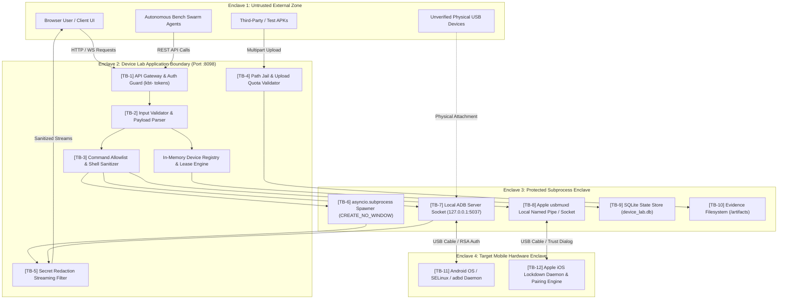

# KELVRA Device Lab — Trust Boundaries & Security Enclaves

## Document Metadata
- **Document Path:** `Kelvra/KELVRA Device Lab/docs/TRUST_BOUNDARIES.md`
- **Subsystem:** KELVRA Device Lab
- **Phase:** Phase 5 — Security Architecture, Authorization, Device Trust & Threat Modeling
- **Authority:** Security Architecture & Attack Surface Governance
- **Emoji Prohibition Compliance:** 100% verified (0 raw Unicode emojis)

---

## 1. System Trust Enclaves

The KELVRA Device Lab security architecture is partitioned into four distinct trust enclaves:

1. **Untrusted External Zone:** Web browser clients, network environments, third-party APK packages, and unverified USB mobile accessories.
2. **Device Lab Application Boundary (Trusted Host Core):** FastAPI ASGI server (`:8098`), request validator, command allowlist engine, and session manager.
3. **Protected Execution Enclave:** Controlled child worker subprocesses (`adb logcat`, `scrcpy-server`, emulator instances) executing under least-privilege user credentials with path jails.
4. **Mobile Device Hardware Sandbox:** Physical and virtual Android/iOS devices operating under their respective OS kernel sandboxes (SELinux, Android Application Sandbox, iOS sandbox).

---

## 2. Trust Boundary Analysis Matrix

| Boundary ID | Interfacing Entities | Data Crossing Boundary | Permitted Actions | Validation & Enforcement Mechanisms | Potential Failure / Attack Modes | Defense & Containment |
|---|---|---|---|---|---|---|
| **TB-1** | Browser UI -> Application Server | HTTP headers, JSON bodies, WebSocket messages | Query fleet, start streams, inject input, run tests | Bearer token verification (`kbt-` tokens), origin validation, WebSocket connection handshake | Stolen token, unauthorized LAN access, cross-site hijacking | Binds strictly to `127.0.0.1`; origin header enforcement; token scope verification. |
| **TB-2** | API Controller -> Device Registry | Structured request DTOs | Lease acquisition, state transitions | Pydantic model validation; state transition matrix check | Invalid state transition, race condition lease stealing | In-memory atomic lease locks; single-writer verification. |
| **TB-3** | Application Server -> Subprocess Spawner | Executable path and command argument arrays | Spawn logcat, spawn scrcpy, start emulator | Explicit command allowlisting; strict argument arrays (`shell=False`) | Shell metacharacter injection (`;`, `&`, `|`, `$`) | String formatting prohibited; shell metacharacters rejected; command template matching. |
| **TB-4** | Client File Upload -> Local Filesystem | Multipart raw binary APK / IPA files | Staging build artifacts for installation | File extension check (`.apk`, `.ipa`), file size quota (<= 150 MB), path traversal check | Path traversal (`../../etc/passwd`), disk exhaustion, zip bombs | Canonical path resolution inside `/artifacts/evidence/`; size ceiling; random UUID filenames. |
| **TB-5** | Device Streams -> Client WebSocket | Live logcat lines, telemetry JSON, video frames | Stream transmission to browser client | Real-time regex secret redaction; binary frame size validation | Leaking API keys, bearer tokens, or user passwords in system logs | Regex scanning matching Bearer, token, and password patterns; replacement with `[REDACTED_SECRET]`. |
| **TB-6** | Subprocess Worker -> Host OS | OS process execution calls | Spawning child CLI tools | Windows process flags (`CREATE_NO_WINDOW`, `0x08000000`), PID registry | Orphan processes persisting after server shutdown, runaway CPU | Active PID tracking; `atexit` termination handlers; Windows Job Object termination. |
| **TB-7** | Host ADB Client -> Local ADB Daemon | Binary ADB protocol packets over TCP | Device enumeration, forward ports, shell commands | Localhost socket communication on port `5037` | ADB server crash, corrupted packet injection | Socket timeout limits (3s); non-blocking asyncio read loops; auto-restart recovery. |
| **TB-8** | Host Provider -> Apple usbmuxd | usbmuxd plist packets over socket | Query iOS device properties, start syslog | Pure-Python client communication; standard lockdown queries | Unhandled protocol change, invalid packet framing | Exception trapping; isolates iOS provider from crashing Android providers. |
| **TB-9** | Application Server -> SQLite WAL | SQL queries and parameters | Query/update device records, audit logs | Parameterized SQL queries via standard `sqlite3` driver | SQL injection, database corruption during sudden power loss | 100% parameterized queries; Write-Ahead Logging (WAL) enabled; schema migration checks. |
| **TB-10**| Test Runner -> Evidence Store | PNG screenshot bytes, JSON reports | Write test artifacts, read screenshots | Path jail; filename generation using strict alphanumeric patterns | Overwriting arbitrary host files, symlink escape | Absolute path validation ensuring targets remain within `/artifacts/evidence/`. |
| **TB-11**| ADB Server -> Physical Android Device | Low-level USB packets / ADB commands | Command execution, package installation, screencap | Android OS RSA public key authorization; SELinux user-space sandbox | Malicious device firmware, unauthorized device access | Device Lab never bypasses RSA authorization; displays explicit user-facing prompt. |
| **TB-12**| usbmuxd -> Physical Apple Device | usbmuxd USB packets | Read device lockdown attributes, stream syslog | Apple "Trust This Computer" pairing record and lockdown handshake | Untrusted accessory, pairing certificate revocation | Requires manual user confirmation on iOS display; respects developer mode requirements. |
